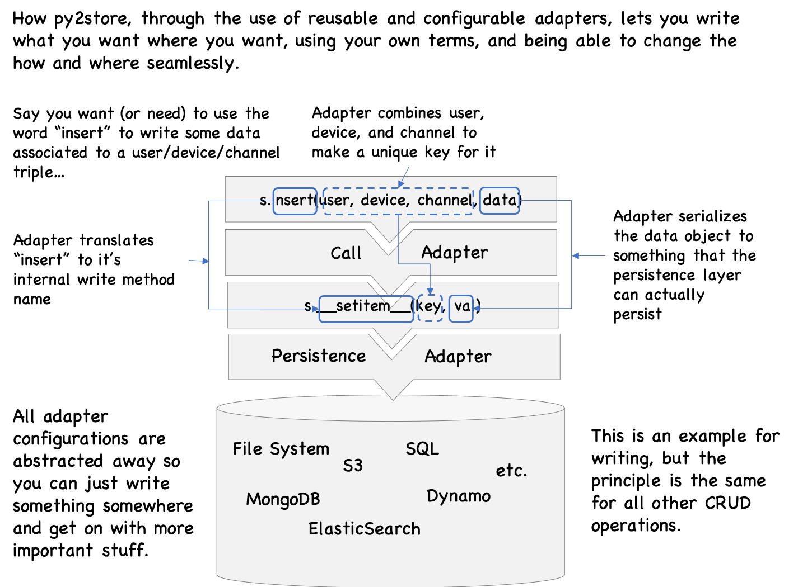

   * [py2store](#py2store)
   * [Quickstart](#quickstart)
   * [Use cases](#use-cases)
      * [Interfacing reads](#interfacing-reads)
      * [Changing where and how things are stored](#changing-where-and-how-things-are-stored)
      * [Adapters: When the learning curve is in the way of learning](#adapters-when-the-learning-curve-is-in-the-way-of-learning)
      * [Thinking about storage later, if ever](#thinking-about-storage-later-if-ever)
   * [More examples](#more-examples)
      * [Looks like a dict](#looks-like-a-dict)
      * [Converting keys: Relative paths and absolute paths](#converting-keys-relative-paths-and-absolute-paths)
      * [Serialization/Deserialization](#serializationdeserialization)
      * [A pickle store](#a-pickle-store)
      * [But how do you change the persister?](#but-how-do-you-change-the-persister)
      * [Talk your own CRUD dialect](#talk-your-own-crud-dialect)
      * [Transforming keys](#transforming-keys)
   * [How it works](#how-it-works)
   * [A few persisters you can use](#a-few-persisters-you-can-use)
      * [Local Files](#local-files)
      * [MongoDB](#mongodb)
      * [S3, SQL, Zips, Dropbox](#s3-sql-zips-dropbox)
   * [Philosophical FAQs](#philosophical-faqs)
      * [Is a store an ORM? A DAO?](#is-a-store-an-orm-a-dao)
      * [Should storage transform the data?](#should-storage-transform-the-data)
   * [Some links](#some-links)
   

# py2store
Storage CRUD how and where you want it.

List, read, write, and delete data in a structured data source/target, 
as if manipulating simple python builtins (dicts, lists), or through the interface **you** want to interact with, 
with configuration or physical particularities out of the way. 
Also, being able to change these particularities without having to change the business-logic code. 

If you're not a "read from top to bottom" kinda person, here are some tips: 
[Quickstart](#quickstart) will show you a simple example of how it looks and feels. 
[Use cases](#use-cases) will give you an idea of how py2store can be useful to you, if at all, 
and [How it works](#how-it-works) will give you a sense of how it works.
[More examples](#more-examples) will give you a taste of how you can adapt the three main aspects of 
storage (persistence, serialization, and indexing) to your needs.

# Quickstart

Install it (e.g. `pip install py2store`).

Think of type of storage you want to use and just go ahead, like you're using a dict.
Here's an example for local storage (you must you string keys only here). 

```
>>> from py2store import QuickStore
>>>
>>> store = QuickStore()  # will print what (tmp) rootdir it is choosing
>>> # Write something and then read it out again
>>> store['foo'] = 'baz'
>>> 'foo' in store  # do you have the key 'foo' in your store?
True
>>> store['foo']  # what is the value for 'foo'?
'baz'
>>>
>>> # Okay, it behaves like a dict, but go have a look in your file system,  
>>> # and see that there is now a file in the rootdir, named 'foo'!
>>> 
>>> # Write something more complicated
>>> store['hello/world'] = [1, 'flew', {'over': 'a', "cuckoo's": map}]
>>> stored_val = store['hello/world']
>>> stored_val == [1, 'flew', {'over': 'a', "cuckoo's": map}]  # was it retrieved correctly?
True
>>>
>>> # how many items do you have now?
>>> assert len(store) >= 2  # can't be sure there were no elements before, so can't assert == 2
>>> 
>>> # delete the stuff you've written
>>> del store['foo']
>>> del store['hello/world']
```

`QuickStore` will by default store things in local files, using pickle as the serializer.
If a root directory is not specified, 
it will use a tmp directory it will create (the first time you try to store something) 
It will create any directories that need to be created to satisfy any/key/that/contains/slashes.
Of course, everything is configurable.

# Use cases

## Interfacing reads

How many times did someone share some data with you in the form of a zip of some nested folders 
whose structure and naming choices are fascinatingly obscure? And how much time do you then spend to write code 
to interface with that freak of nature? Well, one of the intents of py2store is to make that easier to do. 
You still need to understand the structure of the data store and how to deserialize these datas into python 
objects you can manipulate. But with the proper tool, you shouldn't have to do much more than that.

## Changing where and how things are stored

Ever have to switch where you persist things (say from file system to S3), or change the way key into your data, 
or the way that data is serialized? If you use py2store tools to separate the different storage concerns, 
it'll be quite easy to change, since change will be localized. And if you're dealing with code that was already 
written, with concerns all mixed up, py2store should still be able to help since you'll be able to
more easily give the new system a facade that makes it look like the old one. 

All of this can also be applied to data bases as well, in-so-far as the CRUD operations you're using 
are covered by the base methods.

## Adapters: When the learning curve is in the way of learning

Shinny new storage mechanisms (DBs etc.) are born constantly, and some folks start using them, and we are eventually lead to use them 
as well if we need to work with those folks' systems. And though we'd love to learn the wonderful new 
capabilities the new kid on the block has, sometimes we just don't have time for that. 

Wouldn't it be nice if someone wrote an adapter to the new system that had an interface we were familiar with? 
Talking to SQL as if it were mongo (or visa versa). Talking to S3 as if it were a file system. 
Now it's not a long term solution: If we're really going to be using the new system intensively, we 
should learn it. But when you just got to get stuff done, having a familiar facade to something new 
is a life saver. 

py2store would like to make it easier for you roll out an adapter to be able to talk 
to the new system in the way **you** are familiar with.
 
## Thinking about storage later, if ever

You have a new project or need to write a new app. You'll need to store stuff and read stuff back. 
Stuff: Different kinds of resources that your app will need to function. Some people enjoy thinking 
of how to optimize that aspect. I don't. I'll leave it to the experts to do so when the time comes. 
Often though, the time is later, if ever. Few proof of concepts and MVPs ever make it to prod. 

So instead, I'd like to just get on with the business logic and write my program. 
So what I need is an easy way to get some minimal storage functionality. 
But when the time comes to optimize, I shouldn't have to change my code, but instead just change the way my 
DAO does things. What I need is py2store.

# More examples

## Looks like a dict
Below, we make a default store and demo a few basic operations on it.
The default store uses a dict as it's backend persister. 
A dict is neither really a backend, nor a persister. But it helps to try things out with no
footprint.

```python
from py2store.base import Store

s = Store()
assert list(s) == []
s['foo'] = 'bar'  # put 'bar' in 'foo'
assert 'foo' in s  # check that 'foo' is in (i.e. a key of) s
assert s['foo'] == 'bar'  # see that the value that 'foo' contains is 'bar'
assert list(s) == ['foo']  # list all the keys (there's only one)
assert list(s.items()) == [('foo', 'bar')]  # list all the (key, value) pairs
assert list(s.values()) == ['bar']  # list all the values
assert len(s) == 1  # Number of items in my store
s['another'] = 'item'  # store another item
assert len(s) == 2  # Now I have two!
assert list(s) == ['foo', 'another']  # here they are
```

There's nothing fantastic in the above code. 
I've just demoed some operations on a dict.
But it's exactly this simplicity that py2store aims for. 
You can now replace the `s = Store()` with `s = AnotherStore(...)` where `AnotherStore` 
now uses some other backend that could be remote or local, could be a database, or any 
system that can store `something` (the value) `somewhere` (the key).

You can choose from an existing store (e.g. local files, for AWS S3, for MongoDB) or 
quite easily make your own (more on that later).

And yet, it will still look like you're talking to a dict. This not only means that you can 
talk to various storage systems without having to actually learn how to, but also means 
that the same business logic code you've written can be reused with no modification. 

But py2store offers more than just a simple consistent facade to **where** you store things, 
but also provides means to define **how** you do it.

In the case of key-value storage, the "how" is defined on the basis of the keys (how you reference) 
the objects you're storing and the values (how you serialize and deserialize those objects).
 

## Converting keys: Relative paths and absolute paths
Take a look at the following example, that adds a layer of key conversion to a store.

```python
# defining the store
from py2store.base import Store

class PrefixedKeyStore(Store):
    prefix = ''
    def _id_of_key(self, key):
        return self.prefix + key  # prepend prefix before passing on to store
    def _key_of_id(self, _id):
        if not _id.startswith(self.prefix):
            raise ValueError(f"_id {_id} wasn't prefixed with {self.prefix}")
        else:
            return _id[len(self.prefix):]  # don't show the user the prefix
            
# trying the store out            
s = PrefixedKeyStore()
s.prefix = '/ROOT/'
assert list(s) == []
s['foo'] = 'bar'  # put 'bar' in 'foo'
assert 'foo' in s  # check that 'foo' is in (i.e. a key of) s
assert s['foo'] == 'bar'  # see that the value that 'foo' contains is 'bar'
assert list(s) == ['foo']  # list all the keys (there's only one)
assert list(s.items()) == [('foo', 'bar')]  # list all the (key, value) pairs
assert list(s.values()) == ['bar']  # list all the values
assert len(s) == 1  # Number of items in my store
s['another'] = 'item'  # store another item
assert len(s) == 2  # Now I have two!
assert list(s) == ['foo', 'another']  # here they are      
```


Q: That wasn't impressive! It's just the same as the first Store. What's this prefix all about?

A: The prefix thing is hidden, and that's the point. You want to talk the "relative" (i.e "prefix-free")
language, but may have the need for this prefix to be prepended to the key before persisting the data
and that prefix to be removed before being displayed to the user. 
Think of working with files. Do you want to have to specify the root folder every time you store something
or retrieve something?

Q: Prove it!

A: Okay, let's look under the hood at what the underlying store (a dict) is dealing with:

```python
assert list(s.store.items()) == [('/ROOT/foo', 'bar'), ('/ROOT/another', 'item')]
```

You see? The keys that the "backend" is using are actually prefixed with `"/ROOT/"`

## Serialization/Deserialization

Let's now demo serialization and deserialization. 

Say we want to deserialize any text we stored by appending `"hello "` to everything stored.

```python
# defining the store
from py2store.base import Store

class MyFunnyStore(Store):
    def _obj_of_data(self, data):
        return f'hello {data}'
    
# trying the store out            
s = MyFunnyStore()
assert list(s) == []
s['foo'] = 'bar'  # put 'bar' in 'foo'
assert 'foo' in s  # check that 'foo' is in (i.e. a key of) s
assert s['foo'] == 'hello bar'  # the value that 'foo' contains SEEMS to be 'hello bar'
assert list(s) == ['foo']  # list all the keys (there's only one)
assert list(s.items()) == [('foo', 'hello bar')]  # list all the (key, value) pairs
assert list(s.values()) == ['hello bar']  # list all the values    
```

Note: This is an easy example to demo on-load transformation of data (i.e. deserialization), 
but wouldn't be considered "deserialization" by all. 
See the [Should storage transform the data?](#should-storage-transform-the-data) discussion below.
 
In the following, we want to serialize our text by upper-casing it (and see it as such) 
when we retrieve the text.

```python
# defining the store
from py2store.base import Store

class MyOtherFunnyStore(Store):
    def _data_of_obj(self, obj):
        return obj.upper()
      
# trying the store out              
s = MyOtherFunnyStore()
assert list(s) == []
s['foo'] = 'bar'  # put 'bar' in 'foo'
assert 'foo' in s  # check that 'foo' is in (i.e. a key of) s
assert s['foo'] == 'BAR'  # see that the value that 'foo' contains is 'bar'
assert list(s) == ['foo']  # list all the keys (there's only one)
assert list(s.items()) == [('foo', 'BAR')]  # list all the (key, value) pairs
assert list(s.values()) == ['BAR']  # list all the values
``` 

In the last to serialization examples, we only implemented one way transformations. 
That's all fine if you just want to have a writer (so only need a serializer) or a reader (so only 
need a deserializer). 
In most cases though, you will need two way transformations, specifying how the object 
should be serialized to be stored, and how it should be deserialized to get your object back. 


## A pickle store

Say you wanted the store to pickle as your serializer. Here's how this could look like.

```python
# defining the store
import pickle
from py2store.base import Store


class PickleStore(Store):
    protocol = None
    fix_imports = True
    encoding = 'ASCII'
    def _data_of_obj(self, obj):  # serializer
        return pickle.dumps(obj, protocol=self.protocol, fix_imports=self.fix_imports)
    def _obj_of_data(self, data):  # deserializer
        return pickle.loads(data, fix_imports=self.fix_imports, encoding=self.encoding)

# trying the store out              
s = PickleStore()
assert list(s) == []
s['foo'] = 'bar'  # put 'bar' in 'foo'
assert s['foo'] == 'bar'  # I can get 'bar' back
# behind the scenes though, it's really a pickle that is stored:
assert s.store['foo'] == b'\x80\x03X\x03\x00\x00\x00barq\x00.'
``` 

Again, it doesn't seem that impressive that you can get back a string that you stored in a dict. 
For two reasons: (1) you don't really need to serialize strings to store them and (2) you don't need to serialize python 
objects to store them in a dict. 
But if you (1) were trying to store more complex types and (2) were actually persisting them in a file system or database, 
then you'll need to serialize.
The point here is that the serialization and persisting concerns are separated from the storage and retrieval concern. 
The code still looks like you're working with a dict.

## But how do you change the persister?

By using a persister that persists where you want. 
You can also write your own. All a persister needs to work with py2store is that it follows the interface 
python's `collections.MutableMapping` (or a subset thereof). More on how to make your own persister later
You just need to follow the collections.MutableMapping interface. 

Below a simple example of how to persist in files under a given folder.
(Warning: If you want a local file store, don't use this, but one of the easier to use, robust and safe stores in the 
stores folder!)

```python
import os
from collections.abc import MutableMapping

class SimpleFilePersister(MutableMapping):
    """Read/write (text or binary) data to files under a given rootdir.
    Keys must be absolute file paths.
    Paths that don't start with rootdir will be raise a KeyValidationError
    """

    def __init__(self, rootdir, mode='t'):
        if not rootdir.endswith(os.path.sep):
            rootdir = rootdir + os.path.sep
        self.rootdir = rootdir
        assert mode in {'t', 'b', ''}, f"mode ({mode}) not valid: Must be 't' or 'b'"
        self.mode = mode

    def __getitem__(self, k):
        with open(k, 'r' + self.mode) as fp:
            data = fp.read()
        return data

    def __setitem__(self, k, v):
        with open(k, 'w' + self.mode) as fp:
            fp.write(v)

    def __delitem__(self, k):
        os.remove(k)

    def __contains__(self, k):
        """ Implementation of "k in self" check.
        Note: MutableMapping gives you this for free, using a try/except on __getitem__,
        but the following uses faster os functionality."""
        return os.path.isfile(k)

    def __iter__(self):
        yield from filter(os.path.isfile, 
                          map(lambda x: os.path.join(self.rootdir, x), 
                              os.listdir(self.rootdir)))
        
    def __len__(self):
        """Note: There's system-specific faster ways to do this."""
        count = 0
        for _ in self.__iter__():
            count += 1
        return count
    
    def clear(self):
        """MutableMapping creates a 'delete all' functionality by default. Better disable it!"""
        raise NotImplementedError("If you really want to do that, loop on all keys and remove them one by one.")
```

Now try this out:
```python
import os
# What folder you want to use. Defaulting to the home folder. You can choose another place, but make sure 
rootdir = os.path.expanduser('~/')  # Defaulting to the home folder. You can choose another place

persister = SimpleFilePersister(rootdir)
foo_fullpath = os.path.join(rootdir, 'foo')
persister[foo_fullpath] = 'bar'  # write 'bar' to a file named foo_fullpath
assert persister[foo_fullpath] == 'bar'  # see that you can read the contents of that file to get your 'bar' back
assert foo_fullpath in persister  # the full filepath indeed exists in (i.e. "is a key of") the persister
assert foo_fullpath in list(persister)  # you can list all the contents of the rootdir and file foo_fullpath in it
```

## Talk your own CRUD dialect

Don't like this dict-like interface? Want to talk **your own** CRUD words? 
We got you covered! Just subclass `SimpleFilePersister` and make the changes you want to make:

```python
class MySimpleFilePersister(SimpleFilePersister):    
    # If it's just renaming, it's easy
    read = SimpleFilePersister.__getitem__
    exists = SimpleFilePersister.__contains__
    n_files = SimpleFilePersister.__len__
    
    # here we want a new method that gives us an actual list of the filepaths in the rootdir
    list_files = lambda self: list(self.__iter__())

    # And for write we want val and key to be swapped in our interface, 
    def write(self, val, key):  # note that we wanted val to come first here (as with json.dump and pickle.dump interface)
        return self.__setitem__(key, val)  

my_persister = MySimpleFilePersister(rootdir)

foo_fullpath = os.path.join(rootdir, 'foo1')
my_persister.write('bar1', foo_fullpath)  # write 'bar1' to a file named foo_fullpath
assert my_persister.read(foo_fullpath) == 'bar1'  # see that you can read the contents of that file to get your 'bar1' back
assert my_persister.exists(foo_fullpath)  # the full filepath indeed exists in (i.e. "is a key of") the persister
assert foo_fullpath in my_persister.list_files()  # you can list all the contents of the rootdir and file foo_fullpath in it
```

## Transforming keys

But dealing with full paths can be annoying, and might couple code too tightly with a particular local system.
We'd like to use relative paths instead. 
Easy: Wrap the persister in the `PrefixedKeyStore` defined earlier. 

```python
s = PrefixedKeyStore(store=persister)  # wrap your persister with the PrefixedKeyStore defined earlier
if not rootdir.endswith(os.path.sep): 
    rootdir = rootdir + os.path.sep  # make sure the rootdir ends with slash
s.prefix = rootdir  # use rootdir as prefix in keys

s['foo2'] = 'bar2'  # write 'bar2' to a file 
assert s['foo2'] == 'bar2'  # see that you can read the contents of that file to get your 'bar2' back
assert 'foo2' in s  
assert 'foo2' in list(s)  
```

# How it works

py2store offers three aspects that you can define or modify to store things where you like and how you like it:
* **Persistence**: Where things are actually stored (memory, files, DBs, etc.)
* **Serialization**: Value transformaton. 
How python objects should be transformed before it is persisted, 
and how persisted data should be transformed into python objects.
* **Indexing**: Key transformation. How you name/id/index your data. 
Full or relative paths. Unique combination of parameters (e.g. (country, city)). Etc.

All of this allows you to do operations such as "store this (value) in there (persitence) as that (key)", 
moving the tedious particularities of the "in there" as well how the "this" and "that" are transformed to fit 
in there, all out of the way of the business logic code. The way it should be.



Note: Where data is actually persisted just depends on what the base CRUD methods 
(`__getitem__`, `__setitem__`, `__delitem__`, `__iter__`, etc.) define them to be. 
 
# A few persisters you can use

We'll go through a few basic persisters that are ready to use.
There are more in each category, and we'll be adding new categories, but 
this should get you started.

Here is a useful function to perform a basic test on a store, given a key and value.
It doesn't test all store method (see test modules for that), but demos 
the basic functionality that pretty much every store should be able to do.

```python
def basic_test(store, k='foo', v='bar'):
    """ This test performs 
    Warning: Don't use on a key k that you don't want to loose!"""
    if k in store:  # deleting all docs in tmp
        del store[k]
    assert (k in store) == False  # see that key is not in store (and testing __contains__)
    orig_length = len(store)  # the length of the store before insertion
    store[k] = v  # write v to k (testing __setitem__)
    assert store[k] == v  # see that the value can be retrieved (testing __getitem__, and that __setitem__ worked)
    assert len(store) == orig_length + 1  # see that the number of items in the store increased by 1
    assert (k in store) == True  # see that key is in store now (and testing __contains__ again)
    assert k in list(store)  # testing listing the (key) contents of a store (and seeing if )
    assert store.get(k) == v  # the get method
    _ = next(iter(store.keys()))  # get the first key (test keys method)
    _ = next(iter(store.__iter__()))  # get the first key (through __iter__)
    k in store.keys()  # test that the __contains__ of store.keys() works
    
    try: 
        _ = next(iter(store.values()))  # get the first value (test values method)
        _ = next(iter(store.items()))  # get the first (key, val) pair (test items method)
    except Exception:
        print("values() (therefore items()) didn't work: Probably testing a persister that had other data in it that your persister doesn't like")
        
    assert (k in store) == True # testing __contains__ again
    del store[k]  # clean up (and test delete)
```
## Local Files

There are many choices of local file stores according to what you're trying to do. 
One general (but not too general) purpose local file store is 
'py2store.stores.local_store.RelativePathFormatStoreEnforcingFormat'.
It can do a lot for you, like add a prefix to your keys (so you can talk in relative instead of absolute paths),
lists all files in subdirectories as well recursively, 
only show you files that have a given pattern when you list them, 
and not allow you to write to a key that doesn't fit the pattern. 
Further, it also has what it takes to create parametrized paths or parse out the parameters of a path. 

```python
from py2store.stores.local_store import RelativePathFormatStoreEnforcingFormat as LocalFileStore
import os

rootdir = os.path.expanduser('~/pystore_tests/')  # or replace by the folder you want to use
os.makedirs(rootdir, exist_ok=True)  # this will make all directories that don't exist. Don't use if you don't want that.

store = LocalFileStore(path_format=rootdir)
basic_test(store, k='foo', v='bar')
```
 
The signature of LocalFileStore is:
```python
LocalFileStore(path_format, mode='',
                buffering=-1, encoding=None, errors=None, newline=None, closefd=True, opener=None)
```

Often path_format is just used to specify the rootdir, as above. 
But you can specify the desired format further.
For example, the following will only yield .wav files, 
and only allow you to write to keys that end with .wav:
```python
store = LocalFileStore(path_format='/THE/ROOT/DIR/{}.wav')
```

The following will additional add the restriction that those .wav files have the format 'SOMESTRING_' 
followed by digits:
```python
store = LocalFileStore(path_format='/THE/ROOT/DIR/{:s}_{:d}.wav')
```

You get the point...

The other arguments of LocalFileStore or more or less those of python's `open` function.
The slight difference is that here the `mode` argument applies both to read and write. 
If `mode='b'` for example, the file will be opened with `mode='rb'` when opened to read and
with `mode='wb'` when opened to write. For assymetrical read/write modes, the 
user can specify a `read_mode` and `write_mode` (in this case the `mode` argument is ignored).

## MongoDB

A MongoDB collection is not as naturally a key-value storage as a file system is.
MongoDB stores "documents", which are JSONs of data, having many (possibly nested) fields that are not 
by default enforced by a schema. So in order to talk to mongo as a key-value store, we need to 
specify what fields should be considered as keys, and what fields should be considered as data. 

By default, the `_id` field (the only field ensured by default to contain unique values) is the single key field, and 
all other fields are considered to be data fields.

```python
from py2store.stores.mongo_store import MongoStore
# The following makes a default MongoStore, the default pymongo.MongoClient settings, 
# and db_name='py2store', collection_name='test', key_fields=('_id',)
store = MongoStore()
basic_test(store, k={'_id': 'foo'}, v={'val': 'bar', 'other_val': 3})
```

But it can get annoying to specify the key as a dict every time.
The key schema is fixed, so you should be able to just specify the tuple of values making the keys.
And you can, with MongoTupleKeyStore

```python
from py2store.stores.mongo_store import MongoTupleKeyStore
store = MongoTupleKeyStore(key_fields=('_id', 'name'))
basic_test(store, k=(1234, 'bob'), v={'age': 42, 'gender': 'unspecified'})
```

## S3, SQL, Zips, Dropbox

S3 persister/stores work pretty much like LocalStores, but stores in S3. You'll need to have an account with 
AWS to use this. Find S3 stores in py2store.stores.s3_stores.

SQL give you read and write access to SQL DBs and tables. 

ZipReader (and other related stores) talks to one or several files, giving you the ability to operate as if the zips were uncompressed. 

Dropbox will give you access to dropbox files through the same dict-like interface.


# Philosophical FAQs

## Is a store an ORM? A DAO?

Call it what you want, really.

It would be tempting to coin py2store as ya(p)orm (yet another (python) object-relational mapping), 
but that would be misleading. The intent of py2store is not to map objects to db entries, 
but rather to offer a consistent interface for basic storage operations. 

In that sense, py2store is more akin to an implementation of the data access object (DAO) pattern. 
Of course, the difference between ORM and DAO can be blurry, so all this should be taken with a grain of salt.

Advantages and disadvantages such abstractions are easy to search and find, but in most cases the 
pros probably outweigh the cons. 

Most data interaction mechanisms can be satisfied by a subset of the collections.abc interfaces.
For example, one can use python's collections.Mapping interface for any key-value storage, making the data access 
object have the look and feel of a dict, instead of using other popular method name choices such for 
such as read/write, load/dump, etc. 
One of the dangers there is that, since the DAO looks and acts like a dict (but is not) a user might underestimate 
the running-costs of some operations.

## Should storage transform the data?

When does "storing data" **not** transform data? The answer is that storage almost always transforms data in some way.
But some of these transformations are taken for granted, because there's so often "attached" 
(i.e. "co-occur") with the raw process of storing. In py2store, the data transformation is attached to (but not entangled with) the store object. 
This means you have a specific place where you can check or change that aspect of storage.

Having a consistent and simple interface to storage is useful. Being able to attach key and value 
transformations to this interface is also very useful. But though you get a lot for cheap, it's 
not free: Mapping the many (storage systems operations) to the one (consistent interface) means 
that, through habit, you might project some misaligned expectations. 
This is one of the known disadvantages of Data Access Objects (DAOs))

Have a look at this surreal behavior:

```python
# defining the store
from py2store.base import Store

class MyFunnyStore(Store):
    def _obj_of_data(self, data):
        return f'hello {data}'
    
# trying the store out            
s = MyFunnyStore()
s['foo'] = 'bar'  # put 'bar' in 'foo'
assert s['foo'] == 'hello bar'  # the value that 'foo' contains SEEMS to be 'hello bar'
# so look how surreal that can be:
s['foo'] = s['foo']  # retrieve what's under 'foo' and store it back into 'foo'
assert s['foo'] == 'hello hello bar'  # what the...
s['foo'] = s['foo']  # retrieve what's under 'foo' and store it back into 'foo'
assert s['foo'] == 'hello hello hello bar'  # No no no! I do not like green eggs and ham!
```

This happens, because though you've said `s['foo'] = 'bar'`, the value returned by `s['foo']` is 
actually `'hello bar'`. Why? Because though you've stored `'bar'`, you're transforming the data when you
read it (that's what `_obj_of_data` does). 

Is that a desirable behavior? Transforming the stored data before handing it to the user? 
Well, this is such a common pattern that it has it's own acronym and tools named after the acronym: ETL.
Extract, Transform, Load. 
What is happening here is that we composed extraction and transformation. Is that acceptable? 

Say I have a big store of tagged audio files of various formats but only want to work with 
files containing the 'gunshot' tag and lasting no more than 10s, and further get the data as a 
waveform (a sequence of samples).   

You'd probably find this acceptable:

```python
audio_file_type=type_of(file)
with open(file, 'wb') as fp:
    file_bytes = fp.read()
wf = convert_to_waveform(file_bytes)
```

Or this:
```python
filt = mk_file_filter(tag='gunshot', max_size_s=10)
for file in filter(filt, audio_source):
    with open(file, 'wb') as fp:
        file_bytes = fp.read()
    wf = convert_to_waveform(file_bytes, audio_file_type=type_of(file))
    send_wf_for_analysis(wf)
```

You might even find it acceptable to put such code in a functions called `get_waveform_from_file`, 
or `generator_of_waveforms_of_filtered_files`. 

So why is it harder to accept something where you make a store that encompasses your needs. 
You do `s = WfStore(audio_source, filt)` and then

```python
wf = s[some_file]  # get a waveform
```

or

```python
for wf in s.values():  # iterate over all waveforms
    send_wf_for_analysis(wf)
```

It's harder to accept precisely because of the simplicity and consistency (with dict operations). 
We're used to `s[some_file]` meaning "give me THE value stored in s, in the 'some_file' slot". 
We're not used to `s[some_file]` meaning 
"go get the data stored in `some_file` and give it to me in a format more convenient for my use".

Stores allow you to compose extraction and transformation, or transformation and loading, 
and further specifying filter, caching, indexing, and many other aspects related to storage. 
Those, py2store helps you create the perspective you want, or need. 

That said, one needs to be careful that the simplicity thus created doesn't induce misuse. 
For example, in the `MyFunnyStore` example above, we may want to use a different store to persist 
and to read, and perhaps reflect their function in their names. For example:

```python
# defining the store
from py2store.base import Store


class ExtractAndTransform(Store):
    def _obj_of_data(self, data):
        return f'hello {data}'
             
store = Store()
extract_and_transform = ExtractAndTransform(store)
store['foo'] = 'bar'  # put 'bar' in 'foo'
assert store['foo'] == 'bar'  # the value that store contains for 'foo' is 'bar'
assert extract_and_transform['foo'] == 'hello bar'  # the value that extract_and_transform gives you is 'bar'
```

# Some links

Presentation at PyBay 2019: https://www.youtube.com/watch?v=6lx0A6oVM5E

ETL: Extract, Transform, Load: https://en.wikipedia.org/wiki/Extract,_transform,_load
ORM: Object-relational mapping: https://en.wikipedia.org/wiki/Object-relational_mapping

DAO: Data access object: https://en.wikipedia.org/wiki/Data_access_object

DRY: https://en.wikipedia.org/wiki/Don%27t_repeat_yourself

SOC: Separation Of Concerns: https://en.wikipedia.org/wiki/Separation_of_concerns

COC: Convention Over Configuration: https://en.wikipedia.org/wiki/Convention_over_configuration
